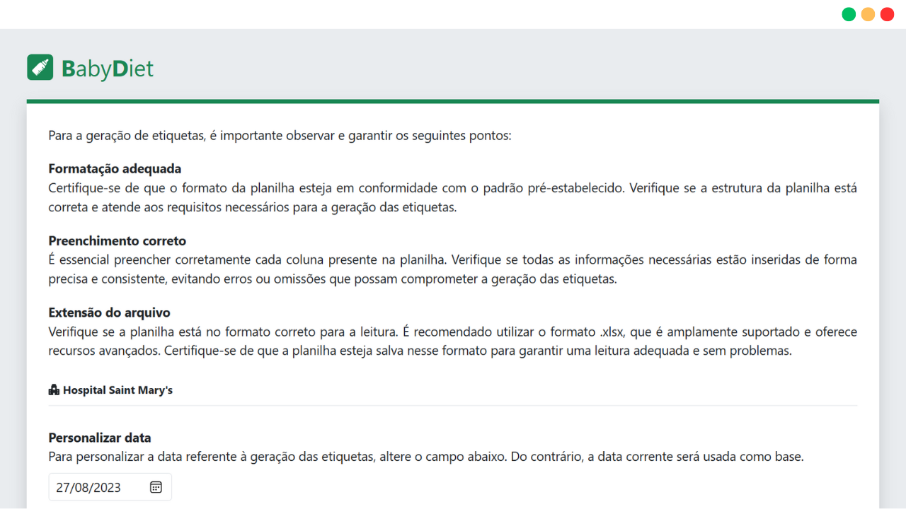
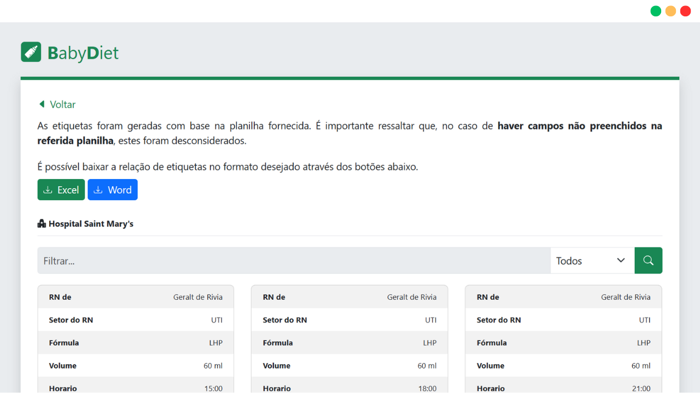

# BabyDiet

**PT-BR**

O Baby Diet é uma aplicação web experimental desenvolvida para demonstrar o processamento de dados provenientes de uma planilha Excel. Seu principal objetivo é gerar etiquetas contendo informações relevantes sobre os horários de alimentação de bebês. A aplicação funciona permitindo que os usuários enviem uma planilha preenchida com todas as informações necessárias. O sistema então avalia o padrão da tabela e os dados inseridos, fornecendo aos usuários um feedback sobre a validade do formato e a adequação do preenchimento dos campos.
<br />

Assumindo que a planilha enviada esteja em conformidade com as diretrizes de padronização, as etiquetas são exibidas ao usuário, que também tem a opção de baixá-las como um arquivo de texto ou um arquivo Excel. Além disso, todas as submissões são registradas no histórico, incluindo o identificador correspondente e o horário de cada ação realizada.
<br /><br />


**EN-US**

Baby Diet is an experimental web application developed to demonstrate the processing of data from an Excel spreadsheet. Its main goal is to generate labels containing relevant information about baby feeding schedules. The application works by allowing users to submit a filled-in spreadsheet with all the necessary information. The system then evaluates the table pattern and data input, providing users with feedback on the validity of the format and the adequacy of the field completion.
<br />

Assuming that the submitted spreadsheet adheres to the standardization guidelines, the labels are displayed to the user, who also has the option to download them as a text file or an Excel file. Furthermore, all submissions are recorded in the history log, including the corresponding identifier and timestamp for each action taken.
<br /><br /><br />


## :rocket: Funcionalidades

1. **Geração de Etiquetas para Mamadeiras**: Gere etiquetas personalizadas para mamadeiras a partir de informações em uma planilha de alimentação de bebês, eliminando a criação manual de etiquetas e poupando tempo e esforço.
2. **Importação de Planilha de Alimentação**: Faça upload de uma planilha com registros de alimentação de bebês. A aplicação usa esses dados para criar as etiquetas das mamadeiras.
3. **Filtragem de Resultados**: Os usuários podem filtrar os registros de alimentação, selecionando quais informações desejam visualizar.
4. **Exportação em Formato TXT e Excel**: Após a geração das etiquetas, os resultados podem ser baixados em formatos TXT (para visualização rápida e compartilhamento) ou Excel (para manipulação detalhada dos dados, se necessário).
5. **Interface Intuitiva e Amigável**: A aplicação possui uma interface simples e acessível, facilitando a importação, filtragem e geração de etiquetas, mesmo para usuários com pouca experiência em tecnologia.
6. **Praticidade e Automatização**: Ao automatizar a geração de etiquetas a partir de uma planilha, a aplicação aumenta a eficiência e a precisão na gestão das informações de alimentação de bebês, substituindo um processo manual propenso a erros.
<br /><br /><br />


## :page_with_curl: Documentação
A documentação da aplicação pode ser acessada através do <a href="https://drive.google.com/drive/folders/1hSKK2wdYA9n6tYgJ0wnSkTzm_Qo3sSq3?usp=sharing">Google Drive</a>. Nela, você encontrará o documento de visão, uma planilha de exemplo e imagens da aplicação em funcionamento em diferentes tamanhos de tela.
<br /><br /><br />


## :computer: Pré-requisitos

### Tecnologias utilizadas
A estrutura backend foi desenvolvida em Python com o framework web Flask, utilizando as bibliotecas Pandas e Openpyxl para leitura, tratamento e armazenamento de dados. No lado do frontend, foram utilizados HTML, CSS e Bootstrap para construir a interface, complementados pelo uso de funções JavaScript para tratamentos específicos.
<br /><br />

### Instalação
Para executar a aplicação em sua máquina, baixe ou clone este repositório. Em seguida, abra o terminal na pasta raiz do projeto e execute o seguinte comando:

```terminal
pip3 install -r requirements.txt
```

Ao fazer isso, todas as bibliotecas necessárias para a aplicação serão instaladas. Para iniciar o servidor, acesse o arquivo `src\run.py` e execute-o. Desse modo, você pode acessar o endereço `127.0.0.1:5000` em seu navegador e experimentar todos os recursos da aplicação.
<br /><br /><br />


## :coffee: Como usar
Para usar a aplicação, será necessário preencher uma planilha contendo informações sobre a dieta de bebês. Para seguir o padrão da aplicação, utilize o modelo disponibilizado via 
<a href="https://docs.google.com/spreadsheets/d/1WS8oWNRsLJ06hMW-DvXXefFIpk0o_kRS">Google Sheets</a>.

Submeta a planilha na tela de início.

<div style="text-align:center">
  
</div>
<div align="center"><b>IMAGEM 1. INÍCIO</b></div>
<br />

Você será direcionado para a tela de etiquetas, onde poderá visualizar, filtrar e baixar as etiquetas como um arquivo de texto ou Excel.

<div style="text-align:center">
  
</div>
<div align="center"><b>IMAGEM 2. ETIQUETAS</b></div>
<br /><br />


## :balance_scale: Licença
Este projeto adota a **Licença MIT**, o que permite que você utilize e faça modificações na aplicação conforme sua vontade. A única coisa que peço é que os créditos sejam dados, reconhecendo o esforço e tempo que investi na construção dela.